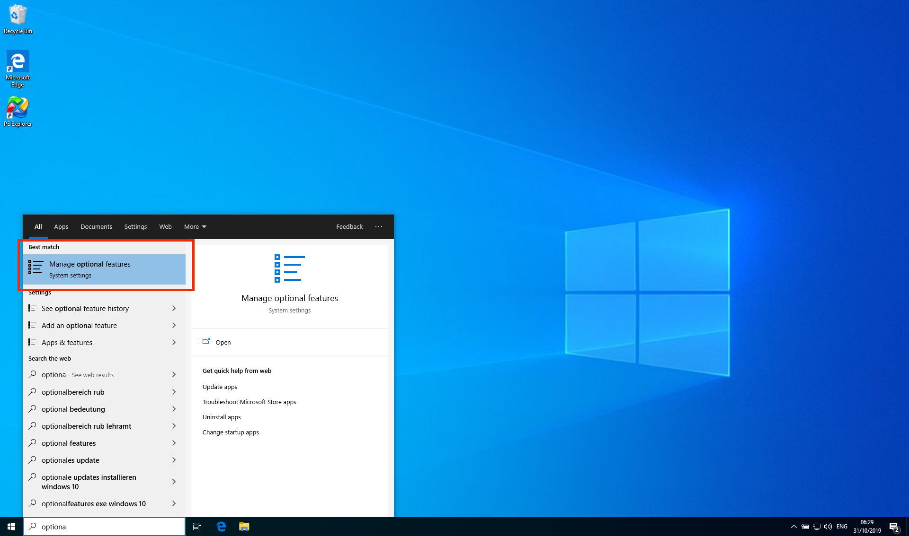
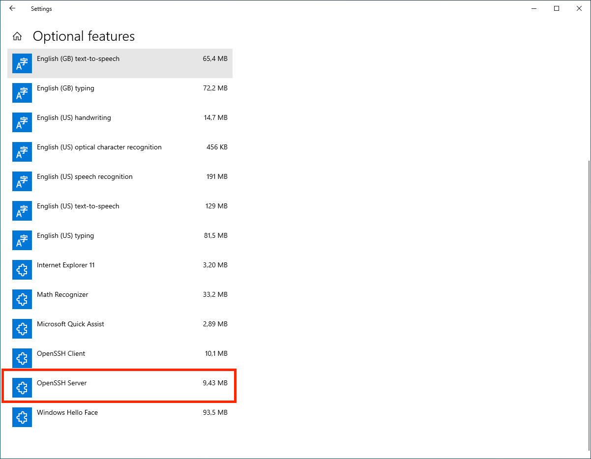
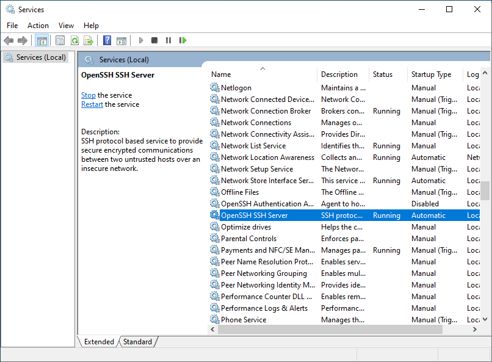
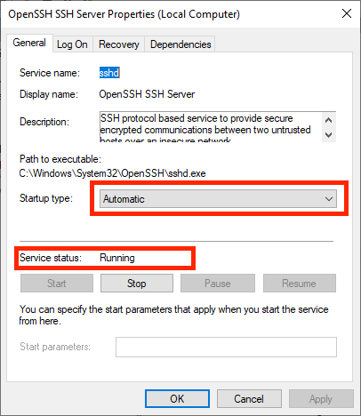
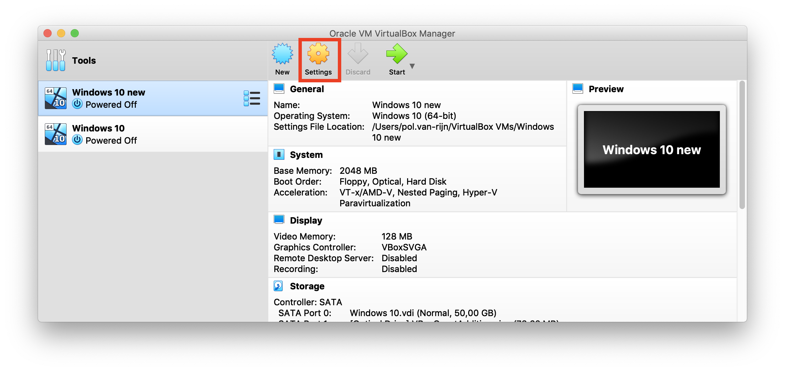
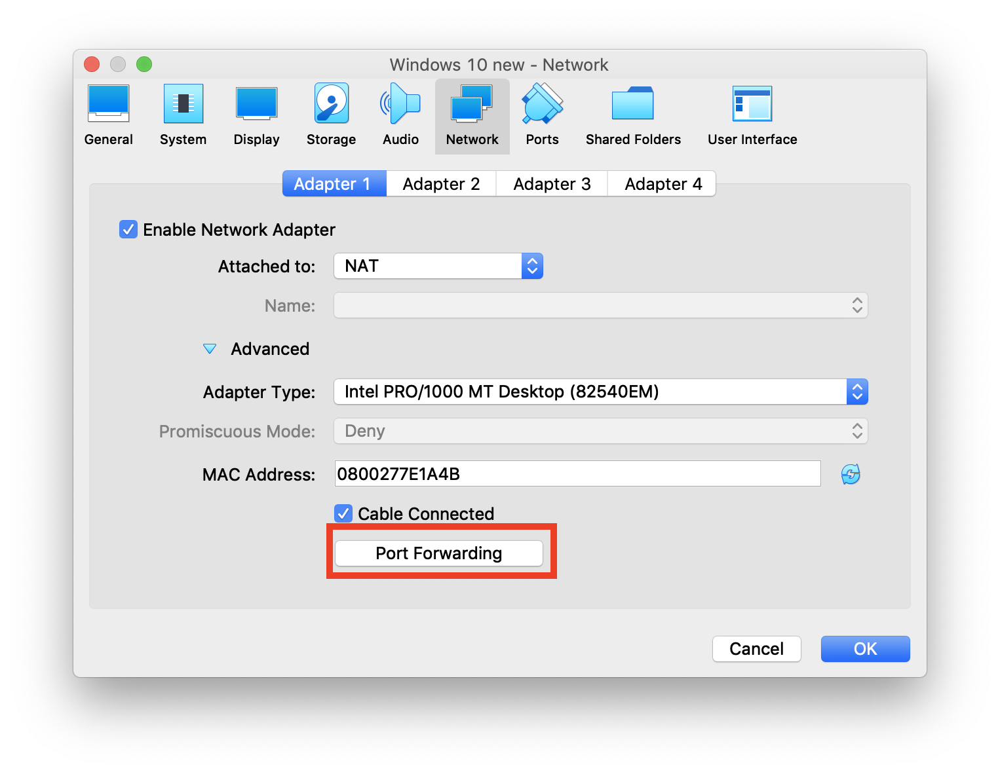
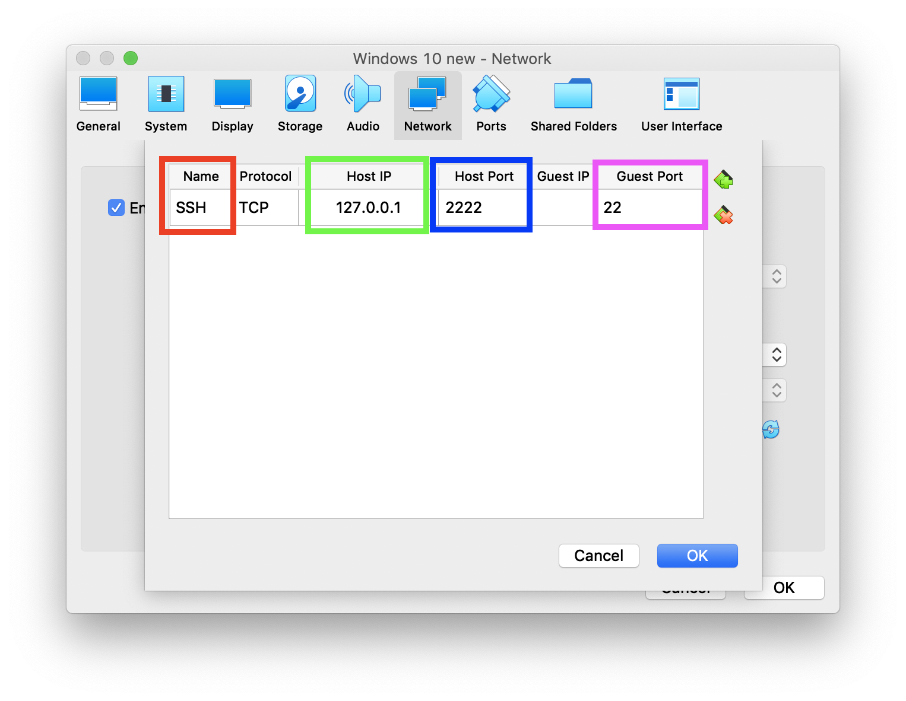

<script src="https://pol.works/R/hide_long_output.js"></script>
<link rel="stylesheet" type="text/css" href="https://pol.works/R/hide_output.css">

You need to have a Windows computer that is accessable over the SSH protocol. I know this solution is far from perfect, but based on the documentation of Mixdorff, I could not reimplement his algorithm in R. We therefore need to setup a Windows server.

**Step 1** The first step is to do download [VirtualBox](https://www.virtualbox.org) a free virtual machine software and install Windows 10.

**Step 2** After installation, you'll need to open `Manage optional features`




**Step 3** Make sure you have `OpenSSH` installed. If not, simply click  `Add a feature` and install it.



**Step 4** Open `Services`, you can do this by typing `Services` into the search bar next to the Windows icon



**Step 5** Find `OpenSSH SSH Server` and right click it and hit `Properties`. Make sure startup type is `Automatic` and the service is running.




**Step 6** Shut down your virtual machine and go to your settings.



Head over to your network settings and click on `Port Forwarding`



Change the following values
* *red* the name of your forward, e.g. `SSH`
* *green* host IP `127.0.0.1`
* *blue* port of host (so not you're virtual machine) `2222` (I would recommend not to pick `22`)
* *purple* port of guest (i.e. virtual machine) `22`



**Step 7** Reboot your computer (you don't need to login). Test it, now open up a terminal on your normal computer and run:

```
ssh usernameWindowsVM@127.0.0.1 -p 2222
```

